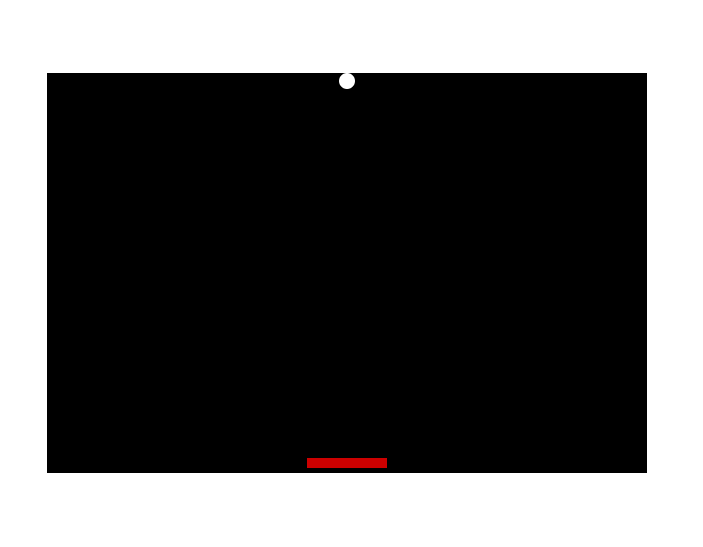

# Oppgave 3

I neste oppgave skal vi utvide grafikken til spillet vårt. Resultatet skal se slik ut:



- Gjenbruk koden fra oppgave 2
- Rektangelet skal ligge helt nederst i ```collage```. Tips: Bruk ```halfHeight``` til å plassere rektangelet i bunn av ```collage```
- Den sorte rammen skal ha bredde ```width``` og høyde ```height```
- Bruk funksjonen ```circle``` til å tegne en sirkel med størrelse 8. Sirkelen skal plasseres helt øverst i den sorte rammen